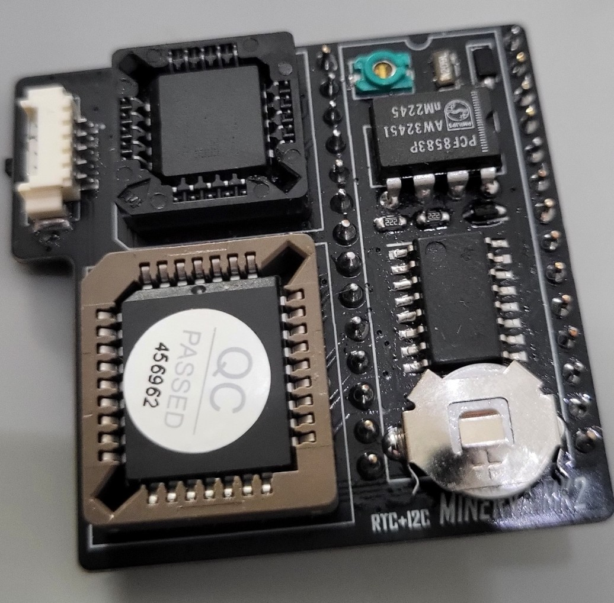
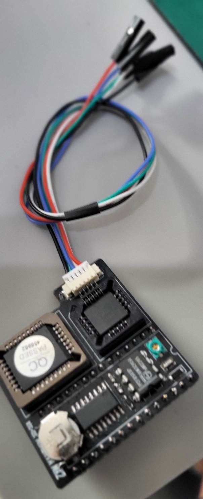

# Sinclair QL - Minerva MK II Reimagined (SMD edition)

A surface-mount redesign of the Minerva MK II ROM and clock board for the Sinclair QL, based on
[Alvaro Alea Fernandez's KiCad recreation](https://github.com/alvaroalea/QL_Minerva_MK2) of the
original 1990 QView board.

The board plugs into the QL's internal ROM socket. It replaces the QL's ROM with a 64 KB EPROM
holding the Minerva operating system, with Toolkit II in the upper 16 KB if you want it, and adds
a battery-backed PCF8583 real-time clock. The clock sits on an I2C port inside the ROM address
space, so the QL reads it with ordinary ROM reads.

<p>
  
  
</p>

Left: the assembled board. Right: with the I2C cable plugged into J2.

## What is different from Alvaro's board

| | Alvaro's board | This board |
|---|---|---|
| Construction | through-hole | surface mount, 42.7 x 40.6 mm, two layers, ground pour on each side |
| EPROM | W27C512, DIP-28 socket, with the 74LS133 soldered underneath it | 27C512 in a PLCC-32 SMD socket; nothing mounted under anything |
| GAL16V8 | DIP-20 socket | PLCC-20 SMD socket, still reprogrammable |
| 13-input NAND | 74LS133, DIP-16 | SN74ALS133, SOP-16 |
| Resistors, diode, crystal, trimmer | axial, DO-35, AT310, radial trimmer | 0603, SOD-123W, FC-135, TZC3 SMD trimmer |
| Expansion header J2 | 2.54 mm pins | PicoBlade 53261 |
| Battery | external, through a two-pin header and a 120 ohm trickle-charge resistor | CR927 coin cell on the board, fed through two Schottky diodes so the cell is never charged and takes over when the QL is off |
| GAL pins 6 and 7 | pin 6 on VCC, pin 7 on /DECODE | pin 6 on SW1, pin 7 on +5 V, as the MINGAL_MH v1.10 equations require; this makes the map-in/map-out of the upper 16 KB work |
| Upper 16 KB select | JP1 solder jumper | SW1 slide switch (see below) |
| Decoupling | two capacitors | four 100 nF: at the GAL, the 74ALS133 and the EPROM on +5 V, and one at the PCF8583 on the battery rail |
| Clock chip testing | none | a small tester board and sketch (see below) |

### A switch instead of a solder jumper

Upstream JP1 was a three-pad solder jumper with its centre pad on the /DECODE net, which is the
74LS133's output. Pads 1 and 2 were bridged by default, so the jumper shorted that output to the
supply. SW1, a slide switch on its own GAL input, replaces it. SW1 selects whether the EPROM's
upper 16 KB (Toolkit II) is mapped in or left free for an external expansion ROM.

### A tester for the clock chips

`pcf8583-tester/` is a small separate board (Arduino Nano plus a DIP-8 socket) and a sketch for
checking PCF8583 chips before one is soldered in. It writes ten test patterns to all 248 bytes
of RAM, checks the clock registers, then drives the chip's oscillator input from the Nano at 100
times real speed to run the whole counter chain: minute, hour, month, leap-year rollovers, the
alarm and the timer. It prints a checklist and a pass or fail verdict in about three seconds.
Second-hand and old-stock PCF8583s vary a lot in quality, and this finds the bad ones. See
[pcf8583-tester/README.md](pcf8583-tester/README.md).

## Repository layout

```
QL_Minerva_MK2.kicad_sch / .kicad_pcb / .kicad_pro   the board (KiCad 10)
gerber/                                              fabrication files for the current board
bom/ibom.html                                        interactive BOM
images/                                              photos
pcf8583-tester/                                      clock chip tester: KiCad project, gerbers, sketch, README
```

The ROM image and the GAL files are not in this repository. They are the work of their
original authors; the next two sections say where to get them and how to prepare them.

## Getting the GAL code

The GAL16V8 needs the MINGAL_MH v1.10 fuse map (`MINGAL_MH_v110.jed`). Alvaro's README says
where his copy came from:

> Main information, GAL code, pictures, etc... has been obtained from this post:
> https://qlforum.co.uk/viewtopic.php?t=1993

That thread on qlforum.co.uk has the JEDEC file, the equations and the history of the v1.00
and v1.10 versions. Program the `.jed` into a GAL16V8 (or an ATF16V8) with any GAL programmer,
for example a TL866 with minipro or Xgpro.

## Building the ROM image with Toolkit II

The 27C512 holds a 1:1 image of the QL's ROM area:

```
0x0000-0xBFFF   Minerva 1.98a1 operating system (48 KB)
0xC000-0xFFFF   Toolkit II 2.36 (16 KB), in the QL's expansion ROM slot
```

The 64 KB image is nothing more than the two files joined, Minerva first.

1. Get Minerva 1.98a1 (the 48 KB ROM file) from Tony Firshman's Minerva page:
   http://tfs.firshman.co.uk/ql/minerva.htm
2. Get the Toolkit II v2.36 ROM image (16 KB) from Dilwyn Jones' site:
   https://dilwyn.qlforum.co.uk/docs/manuals/index.html (Toolkit II section).
3. Check the sizes: Minerva must be exactly 49,152 bytes and Toolkit II 16,384 bytes.
   If the Toolkit II file is shorter, pad it with 0xFF to 16,384 bytes.
4. Join them.

   Linux or macOS:

   ```
   cat Minerva_1.98a1.bin TK2_2.36.rom > Minerva_1.98a1_plus_TK2_2.36.bin
   ```

   Windows (PowerShell):

   ```
   cmd /c copy /b Minerva_1.98a1.bin+TK2_2.36.rom Minerva_1.98a1_plus_TK2_2.36.bin
   ```

   The result must be exactly 65,536 bytes.
5. Burn the 64 KB file into the 27C512 and set SW1 so the upper 16 KB is mapped in.

If you do not want Toolkit II, burn the 48 KB Minerva file on its own (the programmer fills the
rest of the EPROM with 0xFF) and set SW1 so the upper 16 KB is left free for an expansion ROM.

The last four bytes of the Minerva image (0xBFDC-0xBFDF) are the clock's I2C window. The GAL
intercepts reads there, so whatever the EPROM holds at those addresses is never seen; Minerva
reserves them for this purpose.

## Building one

1. Order the board from `gerber/`.
2. Fit the SMD parts, the two PLCC sockets and the CR927 holder. U1 is a 28-pin header row
   mounted on the solder side so the board can be plugged into the QL's ROM socket.
3. Program a GAL16V8 with `MINGAL_MH_v110.jed` and a 27C512 with the Minerva image, with or
   without Toolkit II (see the two sections above).
4. If the PCF8583 is not a new part, run it through the tester first, then fit it.
5. Set SW1: Toolkit II mapped in (64 KB image), or upper 16 KB left free for an expansion ROM.
6. Fit the cell, plug the board into the QL's ROM socket and power up.

## Licence

CERN Open Hardware Licence Version 2, Strongly Reciprocal (CERN-OHL-S v2),
https://ohwr.org/cern_ohl_s_v2.txt, the same licence as Alvaro's repository. The Minerva MK II
design, the Minerva OS and the GAL equations remain the work of their original authors. This
repository only carries the redesigned board.

Board redesign and tester (c) 2026 Arley Silveira. KiCad capture of the original (c) 2024
Alvaro Alea Fernandez.

## References

- Alvaro's repository: https://github.com/alvaroalea/QL_Minerva_MK2
- Minerva at Tony Firshman's site: http://tfs.firshman.co.uk/ql/minerva.htm
- Minerva on the QL wiki: https://wiki.qlforum.co.uk/doku.php?id=qlwiki:minerva
- Manuals and software: https://dilwyn.qlforum.co.uk/docs/manuals/index.html
- Minerva MK II forum thread with the GAL code, pictures and history: https://qlforum.co.uk/viewtopic.php?t=1993
